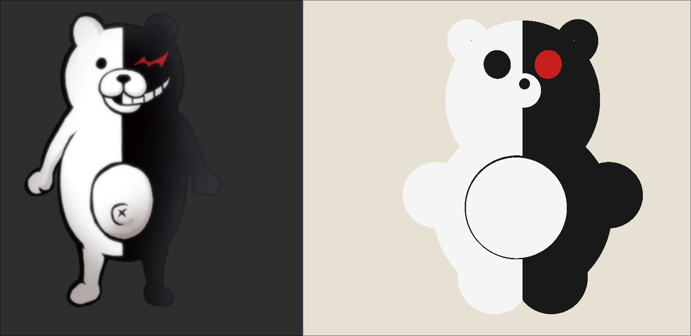

# Monokuma con Raytracing

Pequeno proyecto de raytracing en Rust con `raylib`.

## Que hace

- Renderiza una escena 3D simple usando esferas.
- Incluye una composicion estilo Monokuma construida solo con circulos/esferas.
- Usa un framebuffer propio para pintar la imagen en ventana.

## Requisitos

- Rust
- `cargo`
- `raylib` via la dependencia incluida en `Cargo.toml`

## Ejecutar

```bash
cargo run
```

## Resultado



## Notas

- El color de fondo se controla desde `Framebuffer`.
- La escena principal se arma en `src/main.rs` dentro de `build_monokuma_scene()`.
- La interseccion de rayos con esferas esta en `src/ray_intersect.rs`.
